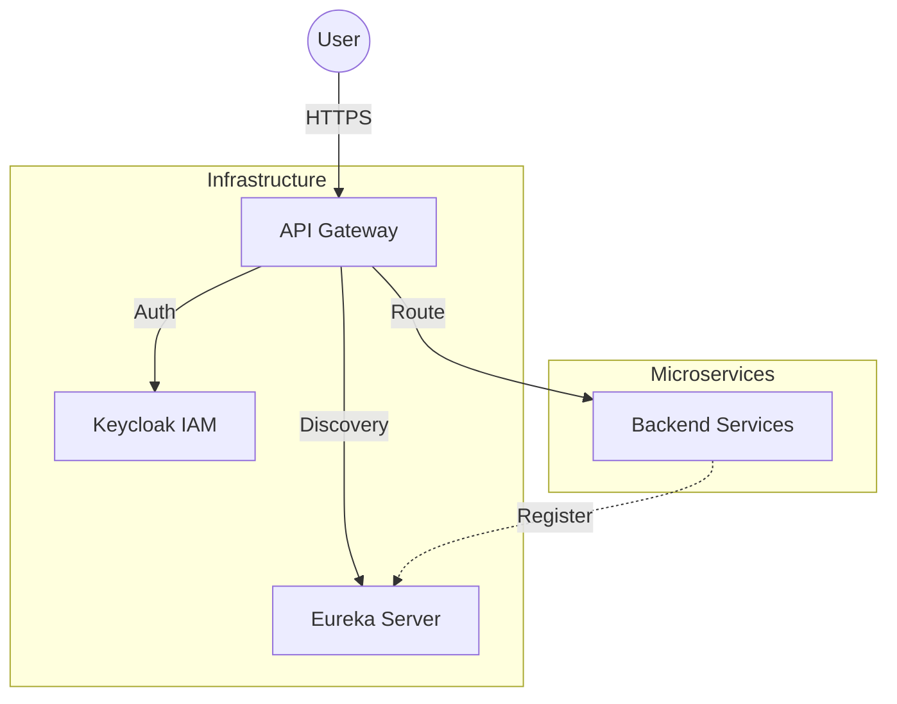

# 🧠 Alzheimer Risk Detection System


## 📌 Overview

The **Alzheimer Risk Detection System** is a distributed microservices platform designed to provide intelligent monitoring for Alzheimer's patients. By leveraging a modern web architecture, this system assists caregivers and doctors in detecting risky situations—such as falls, wandering, or abnormal behavior patterns—in real-time.

Built on a robust **Spring Boot** backend and a responsive **Angular** frontend, this project demonstrates a scalable, secure, and microservices-based approach to healthcare monitoring.

---

## 🏗 System Architecture

The system follows a **Microservices Architecture** pattern, ensuring modularity, scalability, and ease of maintenance.



### Core Components
- **API Gateway**: The single entry point that handles routing, load balancing, and security verification.
- **Discovery Server (Eureka)**: A service registry that allows microservices to locate each other dynamically without hardcoded URLs.
- **Identity Provider (Keycloak)**: Manages centralized authentication and authorization using standard protocols like OAuth2 and OpenID Connect.
- **Frontend Application**: A rich client interface built with Angular 18 and PrimeNG for intuitive interaction.

---

## 🚀 Key Features

- **🛡️ Role-Based Access Control (RBAC)**: Secure dashboards tailored for Admins, Doctors, Caregivers, and Patients.
- **🔐 Centralized Security**: OAuth2/OIDC authentication flow managed by Keycloak.
- **📡 Service Discovery**: Dynamic service registration and scaling capabilities.
- **💻 Modern UI/UX**: clean, responsive design using PrimeNG 17 components.

---

## 🛠 Technology Stack

### Backend
- **Framework**: Spring Boot 2.7.18
- **Language**: Java 17
- **Distributed Systems**: Spring Cloud 2021.0.8, Netflix Eureka, Spring Cloud Gateway
- **Build Tool**: Maven

### Frontend
- **Framework**: Angular 18
- **UI Components**: PrimeNG 17.18.15 + PrimeIcons
- **Styling**: SCSS, PrimeFlex

### Infrastructure
- **Containerization**: Docker & Docker Compose
- **Identity Management**: Keycloak

---

## 📂 Project Structure

```text
alzheimer-system/
├── backend/
│   ├── api-gateway/         # Spring Cloud Gateway implementation
│   └── discovery-server/    # Netflix Eureka Service Registry
├── frontend/
│   └── alzheimer-angular/   # Angular 18 Client Application
└── docker/
    └── keycloak/            # Identity and Access Management configuration
```

*Note: The architecture is designed to support additional microservices (e.g., patient-service, alert-service) as the system expands.*

---

## 🏁 Getting Started

Follow these instructions to set up the project locally for development and testing.

### Prerequisites
- **Java JDK 17**
- **Node.js** (v18 or higher)
- **Docker** & **Docker Compose**
- **Maven** (optional, wrapper included)

### 1. Start Infrastructure
Launch the essential infrastructure containers (Keycloak).
```bash
# From the project root
docker-compose -f docker/docker-compose.yml up -d
```
> **Note**: Ensure Docker Desktop is running. Keycloak will be available at `http://localhost:8081`.

### 2. Start Discovery Server
The service registry must be running for other services to register.
```bash
cd backend/discovery-server
mvn spring-boot:run
```
*Dashboard available at: `http://localhost:8761`*

### 3. Start API Gateway
Launch the gateway to route external requests.
```bash
cd backend/api-gateway
mvn spring-boot:run
```

### 4. Start Frontend
Run the Angular application.
```bash
cd frontend/alzheimer-angular
npm install
ng serve
```
*Application available at: `http://localhost:4200`*

---

## 📈 Roadmap

- [ ] **Patient Service**: Implementation of patient data management.
- [ ] **Cognitive Analysis**: Integration with AI models for behavioral analysis.
- [ ] **Real-time Alerts**: WebSocket integration for instant notifications.


---

## 👨‍💻 Author

**Developed as part of an Academic Engineering Project.**
*Focus Areas: Distributed Systems, Microservices, and Secure Web Architectures.*